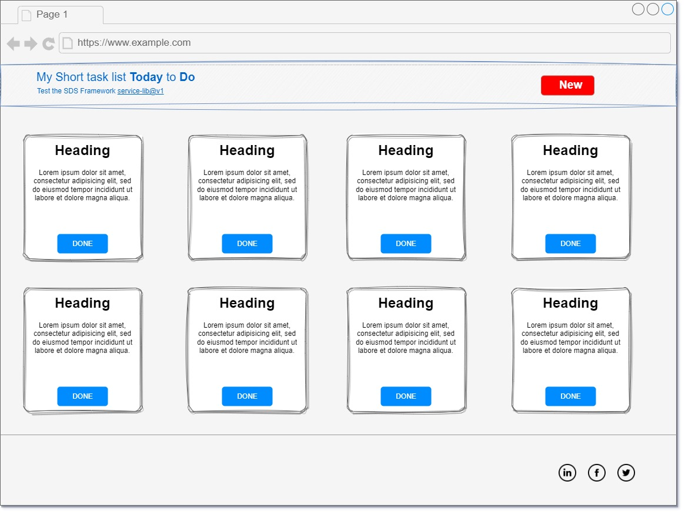
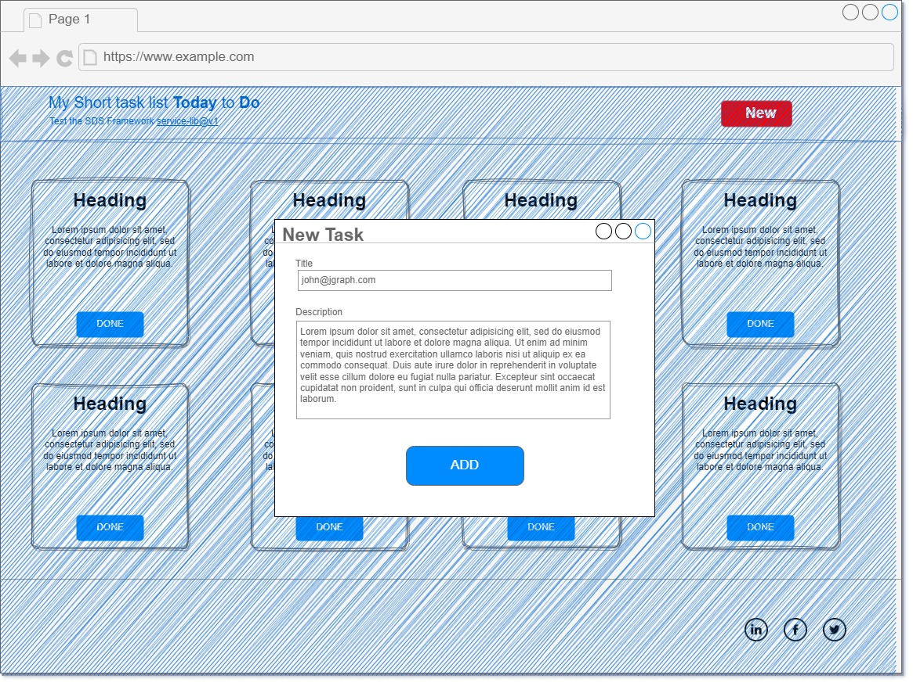

# Today do

> 8 september 2023, Baku Azerbaijan

The first version of [SDS framework](https://github.com/ahmetson/service-lib) is done!
So let's create a simple project to test that framework works as expected.

As an example, let's create a todo app. It's an app for a one user.
The user may add items into the todo list. Once the task is done, it's removed from the list.

The app is consisted of the three parts.

1. *Frontend* &ndash; A web page written in [Next.js](https://nextjs.org/).
2. *Web proxy* &ndash; A web proxy that converts requests over http protocol into zmq protocol.
3. *Backend* &ndash; A backend written in SDS Framework.

## Backend

The backend is an API with the three routes.

| Command | Request Parameters     | Reply Parameters                        | Description                                  |
|---------|------------------------|-----------------------------------------|----------------------------------------------|
| add     | "title", "description" | "number"                                | Adds a new task into todo list               |  
| done    | "number"               |                                         | Removes the task from todo list              |
| list    |                        | Array<"title", "description", "number"> | Returns all the tasks that needs to be done! |

---

## Proxy
Receive the [message.Request](https://github.com/ahmetson/common-lib/blob/main/message/request.go#L23)
from frontend in HTTP protocol. 
The proxy forwards request to the backend in ZMQ protocol.
The result from the backend is replied back to the frontend.

---
## Frontend
It's a single page website that shows the todo list.

At the top, it has a button to add a new tasks. 
Click on the button opens a New task modal.

In the list, all the tasks are represented as the card.
The card has a title, description and a "done" button. 
Click on the button sends a request to the backend.
After a successful reply, the website removes the card from the todo list.

### Wireframes

*All diagrams available on [Source](https://drive.google.com/file/d/1uJOUcLeR_iM6pSZ1ILsbYSvKr5VdZNBS/view?usp=sharing)*

Main page, calls `list` route from backend.



The modal popup when clicked to the **New** button.


---
# Usage

Compile the `backend`:

```powershell
go build -o ./bin/test.exe
```

The backend comes with the pre-generated configuration.
This app configuration is stored in `./backend/bin/app.yml`.
If the backend binary stored in the same directory, then the app will load `app.yml` automatically.

You may delete that to automatically generate a new configuration.

## Run
Any service requires its *id* and *url*.
If you use `app.yml`, then call the app with:
```shell
./bin/test --id=todaydo --url=github.com/ahmetson/today-do
```

## Test from command line interface
Compile the `cli`.
Remember the manager port and handler port from app.yml.
Run it on another terminal.

> Make sure that you run the backend first.

Port `57397` is the manager.
Port `57398` is the manager.

* `./bin/test --port=57397 --cmd=close` &ndash; close the service.
* `./bin/test --port=57398 --cmd=add` &ndash; add a new task.
* `./bin/test --port=57398 --cmd=done --number=1` &ndash; delete the task by its order number.
* `./bin/test --port=57398 --cmd=list` &ndash; returns all tasks.
